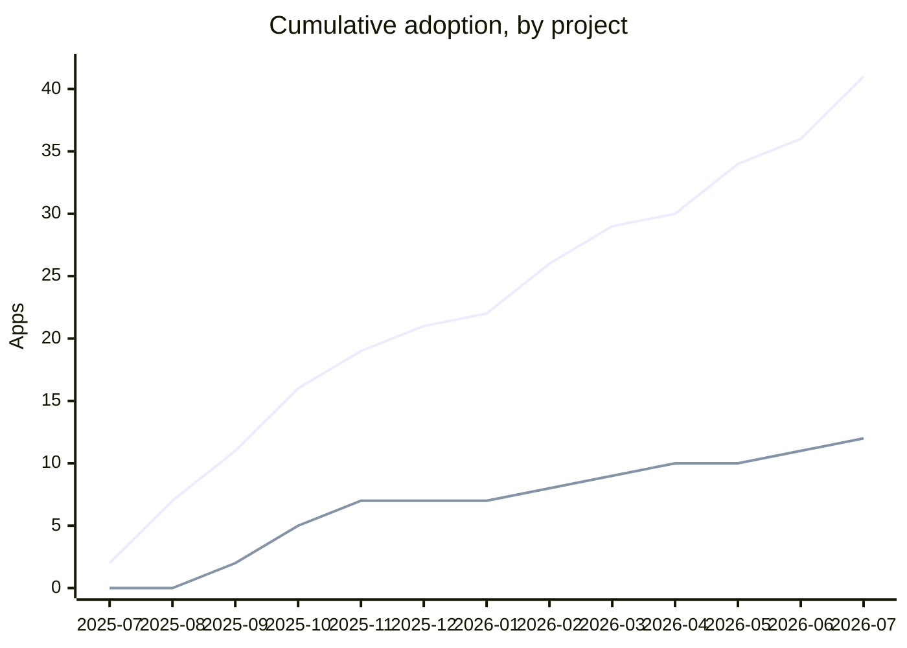
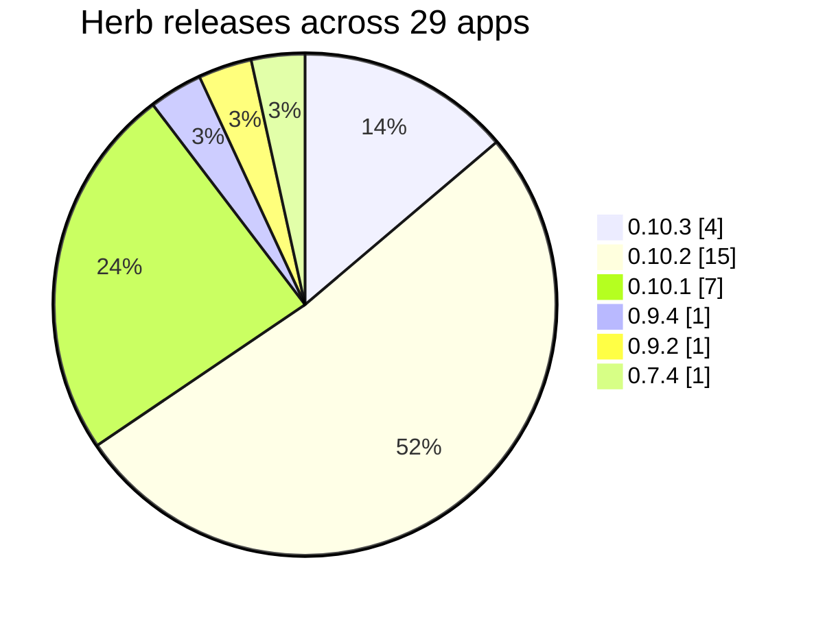

# Herb Corpus

A corpus of real-world Rails applications, used to test [Herb](https://github.com/marcoroth/herb), the
parser, linter, formatter, and printer, against ERB that people actually ship.

Every application is pinned to an exact commit, so results are reproducible across machines and CI.

<!-- corpus:stats:start -->

| Corpus | |
| --- | --- |
| Applications and engines | **263** |
| `.erb`, `.rhtml` and `.herb` files in `erb/` | **34,284** from 234 apps |
| Size of `erb/` | ~53 MB |
| Excluded pending license review | 29 apps |

<!-- corpus:stats:end -->

<sub>Generated by `bin/corpus stats --write`; refreshed automatically by the weekly workflow.</sub>

## Two tiers

```
herb-corpus/
├── apps/        one git submodule per application, pinned to an exact commit
├── erb/         every .erb file extracted flat, with a provenance manifest
├── corpus.yml   provenance and licensing for each app
├── Yerbafile    formatting rules for corpus.yml
└── bin/         management CLI and the scripts CI runs
```

`apps/` is the source of truth; `erb/` is generated from it and committed. They serve different needs:

| | `apps/` | `erb/` |
| --- | --- | --- |
| Contents | Submodules, with full git history available | Every `.erb` file, flat |
| Cost | Several GB on disk, one fetch per remote | Tens of MB, already in the repo |
| How to get it | `bin/corpus clone` | plain `git clone` |
| Use it for | moving pins, full app context, git history | CI, offline runs, bulk parsing |

`erb/MANIFEST.json` records the source repo, commit SHA, and license for every extracted file, so
anything in `erb/` can be traced back to its exact origin.

## Getting it

If you only need the ERB, which is the common case, a plain clone is enough:

```sh
git clone https://github.com/marcoroth/herb-corpus
```

If you need the full applications:

```sh
git clone https://github.com/marcoroth/herb-corpus
cd herb-corpus
bin/corpus clone
```

### Checkouts are ERB-only by default

`bin/corpus clone` combines a blobless partial clone (`--filter=blob:none`) with a sparse checkout
narrowed to `*.erb` plus license and readme files. The difference is large: dev.to is ~1 GB fully
checked out and 34 MB here, cloned in about three seconds.

Pass `--full` for complete working trees when you need runnable apps rather than just their views.

Shallow clones (`--depth 1`) are deliberately **not** used: several apps are pinned to commits that
are not at the tip of their branch, and a shallow fetch cannot reach them.

## The CLI

```
bin/corpus clone     Clone the apps that are not checked out yet (ERB-only by default)
bin/corpus update    Move each pin to the tip of its tracked branch
bin/corpus status    Show each app's pin, checkout state, and drift
bin/corpus drift     Report which pins are behind their branch (no checkout needed)
bin/corpus list      List apps with repo, branch, .erb count, and license
bin/corpus add       Add a new app as a submodule and stub its manifest entry
bin/corpus remove    Remove an app's submodule and checkout
bin/corpus extract   Copy the .erb files into erb/ with a provenance manifest
bin/corpus stats     Print corpus totals, or refresh the generated block in this README
bin/corpus measure   Run Herb versions over the corpus and diff the results
```

Every command takes an optional list of app names to work on a subset, and `--help` for its own
options. Ruby stdlib only, nothing to install.

```sh
bin/corpus status --fetch          # how far behind each pin is
bin/corpus update discourse casa   # move just these two
bin/corpus update --commit         # move everything and commit the pins
bin/corpus extract                 # regenerate erb/ afterwards
```

`update` refuses to touch an app with uncommitted local changes rather than discarding work.

### Adding apps

```sh
bin/corpus add https://github.com/owner/name
bin/corpus add --from apps.tsv --jobs 12
```

The batch file is TSV: `repo`, then optional `branch`, `license`, `redistributable`, and directory
`name` columns. Blank optional columns fall back to branch detection, `unknown`, and the repo's
basename. Cloning runs in parallel; registering submodules is serialized because it takes the index
lock.

## corpus.yml

Each app is one entry in a sequence, keyed by the `name` that every `bin/corpus` command takes:

```yaml
apps:
  - name: lobsters
    repo: lobsters/lobsters
    license: BSD-3-Clause
    license_file: LICENSE
    redistributable: true
```

Optional fields: `upstream` and `fork` when tracking a fork, `note` for anything that needs
explaining, and `exclude_paths` (comma-separated) for apps that license some directories
differently and whose ERB in those directories must not be extracted.

Formatting is maintained by [Yerba](https://github.com/marcoroth/yerba), configured in the
`Yerbafile`: entries stay alphabetical by `name`, fields stay in a fixed order, and one blank line
separates entries. `bin/corpus add` shovels new entries into the parsed document and saves with
`apply: true`, so an added app is sorted into place rather than appended to the end.

```sh
yerba apply    # sort and reformat corpus.yml
yerba check    # exits 1 if it needs reformatting (this runs in CI)
```

Using Yerba rather than parsing and re-emitting the file is what lets the comments and the
hand-written `note:` fields survive automated edits — a serializer round-trip would drop every
comment in the file. `sort_keys` also aborts on unrecognised field names, so a typo fails loudly
instead of being silently preserved.

## Automation

`.github/workflows/weekly-drift.yml` runs every Monday. It calls `bin/corpus drift`, which uses
`git ls-remote` alone, no checkouts, so a week with no drift costs a few hundred ref queries
rather than one clone per application. When pins have moved it clones only those apps, moves
their pins, regenerates their slice of `erb/`, refreshes the stats block above, and opens a single
pull request describing what changed.

Pin updates are **not** merged automatically. Pinned SHAs are what make Herb's results comparable
between runs; if they moved on a schedule, a parser regression and an upstream app changing its
templates would be indistinguishable. A human decides when the baseline moves.

The number worth watching frequently is the parse-error count, and that belongs in Herb's own CI
against a fixed corpus commit, not here.

## Scripts

Everything CI runs lives in `bin/`, so the same command can be run locally before pushing rather
than only by opening a pull request:

| | |
| --- | --- |
| `bin/corpus` | management CLI — clone, update, drift, extract, stats, measure |
| `bin/check` | consistency checks across `.gitmodules`, `corpus.yml`, and `erb/MANIFEST.json` |
| `bin/measure-herb` | measure one Herb version against the corpus |
| `bin/diff-runs` | compare two measurement runs |
| `bin/drift-report` | turn `corpus drift --json` into step outputs and annotations |
| `bin/render-pr-body` | build the weekly pin-update pull request body |

```sh
bundle install
bundle exec bin/check     # what CI checks
bundle exec yerba check   # what CI checks about formatting
```

Only `bin/corpus` and `bin/check` need a gem, and only Yerba. `bin/diff-runs`, `bin/drift-report`,
and `bin/render-pr-body` are Ruby stdlib only, so Herb's CI can compare a branch against a release
with nothing installed beyond a corpus checkout.

**Herb is deliberately not in the Gemfile.** The version under measurement is swapped per run —
`bin/measure-herb` takes either an installed gem version or a working tree, and Herb's CI measures
the last release against the branch in the same job. A Gemfile entry would pin one version for
both and silently compare a branch against itself, so the measurement scripts run with
`BUNDLE_GEMFILE` cleared and resolve Herb themselves.

## Who uses Herb

<!-- corpus:adoption:start -->

### Herb

**41 of 263** applications use Herb: `herb` 31, `@herb-tools/linter` 18, `@herb-tools/formatter` 11, `.herb.yml` 27.

| App | Component | Version | Dependency | Adopted |
| --- | --- | --- | --- | --- |
| [alchemy_cms](https://github.com/AlchemyCMS/alchemy_cms/tree/4ccf43454b3837092663f434f094018d8115b8fe) | linter | ^0.8.10 | explicit | [2025-12-09](https://github.com/AlchemyCMS/alchemy_cms/commit/61d325c3923a18efd6db118c6f734edcab1f0f7f "first seen in package.json") |
|  |  |  |  |  |
| [andrewm.codes](https://github.com/andrewmcodes/andrewm.codes/tree/ba9255567bc2a52ffd4afb0aed8524a035b481d6) | formatter | ^0.10.2 | explicit | [2026-07-16](https://github.com/andrewmcodes/andrewm.codes/commit/92ae0ef2e6fad4003f1b3be59a7c6b769178c406 "first seen in package.json") |
|  | .herb.yml | 0.10.2 | – | [2026-07-16](https://github.com/andrewmcodes/andrewm.codes/commit/92ae0ef2e6fad4003f1b3be59a7c6b769178c406 "first seen in .herb.yml") |
|  |  |  |  |  |
| [archivesspace](https://github.com/archivesspace/archivesspace/tree/47d533d5d0d008920f244ea74c8bf9214157bd51) | linter | ^0.10.1 | explicit | [2026-07-31](https://github.com/archivesspace/archivesspace/commit/1aec51d9013892348e846a582961db1134a30ec6 "first seen in package.json") |
|  | .herb.yml | 0.10.1 | – | [2026-07-31](https://github.com/archivesspace/archivesspace/commit/1aec51d9013892348e846a582961db1134a30ec6 "first seen in .herb.yml") |
|  |  |  |  |  |
| [avo](https://github.com/avo-hq/avo/tree/1bb0c119d097108a52f8271e248286fb085267d3) | formatter | ^0.9.7 | explicit | [2026-03-24](https://github.com/avo-hq/avo/commit/6c04a2d0e5be86743c48df5ed5294a37cc91e189 "first seen in package.json") |
|  | .herb.yml | present | – | [2025-11-27](https://github.com/avo-hq/avo/commit/7fb6bef2c937fb5ded3a3b3fdf3dc108aba092f6 "first seen in .herb.yml") |
|  |  |  |  |  |
| [bank_exit](https://github.com/Bank-Exit/bank_exit/tree/7ddf52cf4a92a1c4d53d553d1c485abd464458bc) | herb | 0.10.2 | explicit | [2026-05-23](https://github.com/Bank-Exit/bank_exit/commit/f8b718d6cf6888bfdd24d3a4684249fa89303591 "first seen in Gemfile") |
|  | .herb.yml | present | – | [2026-05-23](https://github.com/Bank-Exit/bank_exit/commit/f8b718d6cf6888bfdd24d3a4684249fa89303591 "first seen in .herb.yml") |
|  |  |  |  |  |
| [bike_index](https://github.com/bikeindex/bike_index/tree/a4c61e8419257475d16197fc7ab34bdc81a69a4c) | herb | 0.10.1 | explicit | [2025-10-21](https://github.com/bikeindex/bike_index/commit/3001826a1f7b7ba754d664f7a245c58b81bf6201 "first seen in Gemfile") |
|  | linter | ^0.9.2 | explicit | [2025-11-20](https://github.com/bikeindex/bike_index/commit/d71b1d23b570f5a27b70b77b9d265c5f86b4a1f3 "first seen in package.json") |
|  | formatter | ^0.9.2 | explicit | [2025-11-20](https://github.com/bikeindex/bike_index/commit/d71b1d23b570f5a27b70b77b9d265c5f86b4a1f3 "first seen in package.json") |
|  | .herb.yml | 0.9.2 | – | [2025-11-20](https://github.com/bikeindex/bike_index/commit/d71b1d23b570f5a27b70b77b9d265c5f86b4a1f3 "first seen in .herb.yml") |
|  |  |  |  |  |
| [bitcoincash](https://github.com/zquestz/bitcoincash/tree/f8a75b3dd79d94ea0de8da70e34b3d881efa73c6) | herb | 0.10.1 | explicit | [2026-07-02](https://github.com/zquestz/bitcoincash/commit/65e14b5a1161abefd548317ca5e18c24fef056e4 "first seen in Gemfile") |
|  | .herb.yml | 0.10.1 | – | [2026-07-02](https://github.com/zquestz/bitcoincash/commit/def331e2a0b4fb2ea5f28e2ee545441f1c7805f3 "first seen in .herb.yml") |
|  |  |  |  |  |
| [black_lightning](https://github.com/EdinburghUniversityTheatreCompany/black_lightning/tree/b4a93f9735d417c05f0fc76cad4af5c369d8f506) | herb | 0.10.2 | explicit | [2026-06-29](https://github.com/EdinburghUniversityTheatreCompany/black_lightning/commit/179438b9b157ef31c57fc1525941e74c564df0e6 "first seen in Gemfile") |
|  | .herb.yml | 0.10.1 | – | [2026-06-29](https://github.com/EdinburghUniversityTheatreCompany/black_lightning/commit/3885024d6df46495405f148a306f916c2fbf750f "first seen in .herb.yml") |
|  |  |  |  |  |
| [bops](https://github.com/unboxed/bops/tree/c7c543ac29df85c05e5956b065ce31ae0e78e80f) | linter | ^0.8.1 | explicit | [2025-08-04](https://github.com/unboxed/bops/commit/52eac8fbf50a99778a6a30e959cccb563c142b64 "first seen in package.json") |
|  |  |  |  |  |
| [citytori](https://github.com/yokomaru/citytori/tree/947d5c68615b479354e83f03baf64e5b3bc9cee4) | herb | 0.10.2 | explicit | [2026-07-07](https://github.com/yokomaru/citytori/commit/f2176dd5cabb42ae562a18f4a7a086dba0a604a4 "first seen in Gemfile") |
|  | linter | ^0.10.1 | explicit | [2026-07-07](https://github.com/yokomaru/citytori/commit/53f9765184562690a29efe20a4595627fccd3ca3 "first seen in package.json") |
|  | formatter | ^0.10.1 | explicit | [2026-07-07](https://github.com/yokomaru/citytori/commit/53f9765184562690a29efe20a4595627fccd3ca3 "first seen in package.json") |
|  | .herb.yml | 0.10.1 | – | [2026-07-07](https://github.com/yokomaru/citytori/commit/53f9765184562690a29efe20a4595627fccd3ca3 "first seen in .herb.yml") |
|  |  |  |  |  |
| [claim-additional-payments-for-teaching](https://github.com/DFE-Digital/claim-additional-payments-for-teaching/tree/102843d35126fede3791341aec20a241a5bc0d3a) | herb | 0.7.4 | explicit | [2025-11-13](https://github.com/DFE-Digital/claim-additional-payments-for-teaching/commit/034c02c18bcab559335fbdaee8e0d475b6559dd6 "first seen in Gemfile") |
|  |  |  |  |  |
| [community_foundation](https://github.com/rubyforgood/community_foundation/tree/762f3e69238e4ea78cb02a25785d11bbf549b8d8) | herb | 0.10.1 | transitive | [2026-06-22](https://github.com/rubyforgood/community_foundation/commit/34ef5b93f3bf3e753a295b9fa37a57a05799b818 "first seen in Gemfile.lock") |
|  | .herb.yml | 0.10.1 | – | [2026-06-24](https://github.com/rubyforgood/community_foundation/commit/539131cdd2aeedd873e7a233da74764efe6cc50f "first seen in .herb.yml") |
|  |  |  |  |  |
| [conference-app](https://github.com/kaigionrails/conference-app/tree/2b02193918fd16a5e11abe5b7b8ffdc6fbd0b0e4) | herb | 0.10.2 | explicit | [2025-10-02](https://github.com/kaigionrails/conference-app/commit/ef7ff517d6676a169f21fa3ac8d822cd974ed3c0 "first seen in Gemfile") |
|  |  |  |  |  |
| [csa-admin](https://github.com/csa-admin-org/csa-admin/tree/6607650aea5d7292ebda636794fa30b2359e095f) | herb | 0.10.3 | explicit | [2025-08-05](https://github.com/csa-admin-org/csa-admin/commit/2377199f5dfcdd0de9177be17d61029a9bed212c "first seen in Gemfile") |
|  | linter | ^0.10.3 | explicit | [2025-11-20](https://github.com/csa-admin-org/csa-admin/commit/04896f9b08c08983f75ce8a156e211da1df77518 "first seen in package.json") |
|  | formatter | ^0.10.3 | explicit | [2025-11-15](https://github.com/csa-admin-org/csa-admin/commit/e79ef1da608555d0a6b079ba8a3ea97521de1fd9 "first seen in package.json") |
|  | .herb.yml | 0.10.3 | – | [2025-11-15](https://github.com/csa-admin-org/csa-admin/commit/e79ef1da608555d0a6b079ba8a3ea97521de1fd9 "first seen in .herb.yml") |
|  |  |  |  |  |
| [energy-sparks](https://github.com/Energy-Sparks/energy-sparks/tree/a9a9b0b4afe1941507a35910c6f66d0b5d81b9a8) | herb | 0.10.1 | transitive | [2026-04-24](https://github.com/Energy-Sparks/energy-sparks/commit/2152231cb10f2689a604e1db8dd7cbb5fca12702 "first seen in Gemfile.lock") |
|  |  |  |  |  |
| [errbit](https://github.com/errbit/errbit/tree/d172d02be24bd5462c8fcbd90baeb6e4ae5ed155) | herb | 0.10.2 | explicit | [2025-09-04](https://github.com/errbit/errbit/commit/e4d5afd4833250cf5e5ecb5862619f09481032f6 "first seen in Gemfile") |
|  |  |  |  |  |
| [eva-serveur](https://github.com/betagouv/eva-serveur/tree/ba5c0f24127ae8920a5a7c4f7ee9a3baff3f43d3) | herb | 0.10.1 | transitive | [2025-11-19](https://github.com/betagouv/eva-serveur/commit/195c9ff9f9b3a243ee550aab0df2890e5c83b3e9 "first seen in Gemfile.lock") |
|  |  |  |  |  |
| [evemonk](https://github.com/evemonk/evemonk/tree/0a09506f0f85729683ce45cdae8c4ce791b0bb72) | herb | 0.10.2 | explicit | [2025-09-19](https://github.com/evemonk/evemonk/commit/b410ba90826048cec6087c2849fc56ed95da2d0a "first seen in Gemfile") |
|  |  |  |  |  |
| [feedyour.email](https://github.com/indirect/feedyour.email/tree/985e4ed1ab51672661d5b46a60c3690c3095a249) | herb | 0.10.2 | explicit | [2026-07-18](https://github.com/indirect/feedyour.email/commit/fb5cd53648d5cc645a413009e0414b9600383edd "first seen in Gemfile") |
|  |  |  |  |  |
| [flowbite-components](https://github.com/substancelab/flowbite-components/tree/71ca96a6ce592ff5253ea7071429e00054ccd38d) | herb | present | explicit | [2025-08-01](https://github.com/substancelab/flowbite-components/commit/4bdffa41e59cb4f41f8bf236b77a801307b3121d "first seen in Gemfile") |
|  | linter | ^0.10.1 | explicit | [2026-06-30](https://github.com/substancelab/flowbite-components/commit/462bd1497e4104f6c5a0a8ca45aa1afa5fe87af6 "first seen in package.json") |
|  | .herb.yml | 0.10.1 | – | [2026-06-30](https://github.com/substancelab/flowbite-components/commit/fec24a01249397a82b40f250156ac7a9e0d33308 "first seen in .herb.yml") |
|  |  |  |  |  |
| [fundamento-cloud](https://github.com/Ikigai-Systems/fundamento-cloud/tree/0a052709d6e0898e4cfaa9f219c1e18f501e93cf) | herb | 0.10.1 | transitive | [2026-03-23](https://github.com/Ikigai-Systems/fundamento-cloud/commit/06de68eee82088e4d5e0bac68e4cf0f663e8c7fc "first seen in Gemfile.lock") |
|  | linter | ^0.10.2 | explicit | [2026-04-24](https://github.com/Ikigai-Systems/fundamento-cloud/commit/a49d21f9c9f146cde97c04ca37991d4c75d7d227 "first seen in package.json") |
|  | .herb.yml | 0.9.7 | – | [2026-04-23](https://github.com/Ikigai-Systems/fundamento-cloud/commit/9d001db4f427619f8a6bdc73868f5d3cc63fbb7f "first seen in .herb.yml") |
|  |  |  |  |  |
| [ha-addon](https://github.com/timeframe/ha-addon/tree/36734ef77017cce222057b9f0d93f489cd336d88) | herb | present | explicit | [2026-05-14](https://github.com/timeframe/ha-addon/commit/6eba6a673bd69addfd0c261b66bba851dd2cded5 "first seen in Gemfile") |
|  | .herb.yml | present | – | [2026-05-14](https://github.com/timeframe/ha-addon/commit/6eba6a673bd69addfd0c261b66bba851dd2cded5 "first seen in .herb.yml") |
|  |  |  |  |  |
| [hanakai-site](https://github.com/hanakai-rb/site/tree/7cbd0bc42923168eb132175bc9c8324ca62b8fe6) | herb | 0.9.4 | explicit | [2026-04-15](https://github.com/hanakai-rb/site/commit/ef38f557d5f2b111038e6ec9f6b726788c65056f "first seen in Gemfile") |
|  | linter | ^0.9.4 | explicit | [2025-09-12](https://github.com/hanakai-rb/site/commit/58efcaf85ab136c3e7f9479bb3bcea1f9fd4bc14 "first seen in package.json") |
|  | formatter | ^0.9.4 | explicit | [2025-09-12](https://github.com/hanakai-rb/site/commit/58efcaf85ab136c3e7f9479bb3bcea1f9fd4bc14 "first seen in package.json") |
|  | .herb.yml | 0.9.4 | – | [2026-04-15](https://github.com/hanakai-rb/site/commit/ef38f557d5f2b111038e6ec9f6b726788c65056f "first seen in .herb.yml") |
|  |  |  |  |  |
| [identity-dashboard](https://github.com/18F/identity-dashboard/tree/5526cea52db07fda45679443904a2f916573d329) | linter | ^0.8.7 | explicit | [2026-01-14](https://github.com/18F/identity-dashboard/commit/8dce661a09809281a9f52f805f1b481dba84aa24 "first seen in package.json") |
|  | .herb.yml | 0.8.7 | – | [2026-01-14](https://github.com/18F/identity-dashboard/commit/8dce661a09809281a9f52f805f1b481dba84aa24 "first seen in .herb.yml") |
|  |  |  |  |  |
| [irida-next](https://github.com/phac-nml/irida-next/tree/4e21952b0c1c5f11664349854087930e550d81e5) | herb | 0.9.2 | transitive | [2026-02-17](https://github.com/phac-nml/irida-next/commit/96e998bea3387d2d24c641f00db0718b56c7e7dd "first seen in Gemfile.lock") |
|  | linter | ^0.10.2 | explicit | [2026-02-17](https://github.com/phac-nml/irida-next/commit/96e998bea3387d2d24c641f00db0718b56c7e7dd "first seen in package.json") |
|  | formatter | ^0.10.2 | explicit | [2026-02-17](https://github.com/phac-nml/irida-next/commit/96e998bea3387d2d24c641f00db0718b56c7e7dd "first seen in package.json") |
|  | .herb.yml | 0.10.2 | – | [2026-02-17](https://github.com/phac-nml/irida-next/commit/96e998bea3387d2d24c641f00db0718b56c7e7dd "first seen in .herb.yml") |
|  |  |  |  |  |
| [karafka-web](https://github.com/karafka/karafka-web/tree/3afabcb4a0f8154fea67f89319cc193d9311366d) | linter | ^0.10.0 | explicit | [2025-12-23](https://github.com/karafka/karafka-web/commit/8b5757bff84bdd51e6e10ff5de0ee34b8d1c9d30 "first seen in package.json") |
|  | .herb.yml | 0.9.2 | – | [2025-12-23](https://github.com/karafka/karafka-web/commit/8b5757bff84bdd51e6e10ff5de0ee34b8d1c9d30 "first seen in .herb.yml") |
|  |  |  |  |  |
| [Libreverse-Legacy](https://github.com/Libreverse/Libreverse-Legacy/tree/8818ea1fc1149a01fb35af95dbec1ee2fc044382) | herb | 0.10.2 | transitive | [2025-09-21](https://github.com/Libreverse/Libreverse-Legacy/commit/e9b546610c5f75201d879183714f7163f62e33c5 "first seen in Gemfile.lock") |
|  |  |  |  |  |
| [maintenance_tasks](https://github.com/Shopify/maintenance_tasks/tree/c84696e41c1dabc3dd660116cb03efe0c01f1745) | herb | 0.10.2 | explicit | [2026-05-15](https://github.com/Shopify/maintenance_tasks/commit/1a96d637506eb28c8eb5af69738f243f9fa1261f "first seen in Gemfile") |
|  | .herb.yml | present | – | [2026-05-15](https://github.com/Shopify/maintenance_tasks/commit/1a96d637506eb28c8eb5af69738f243f9fa1261f "first seen in .herb.yml") |
|  |  |  |  |  |
| [mampf](https://github.com/MaMpf-HD/mampf/tree/dad1e3c151c6985ee754aaa7ad97019c6c3eed47) | linter | ^0.9.5 | explicit | [2026-02-17](https://github.com/MaMpf-HD/mampf/commit/6914f4c1fa7161eb00b78fff640a1c3f8ab331ff "first seen in package.json") |
|  | formatter | ^0.9.5 | explicit | [2026-02-17](https://github.com/MaMpf-HD/mampf/commit/6914f4c1fa7161eb00b78fff640a1c3f8ab331ff "first seen in package.json") |
|  | .herb.yml | 0.9.4 | – | [2026-04-04](https://github.com/MaMpf-HD/mampf/commit/a4cb31b49518aeec026f8db27306caa9909ea908 "first seen in .herb.yml") |
|  |  |  |  |  |
| [moj-components](https://github.com/ministryofjustice/moj-components/tree/962a881f2ca5f7bd87d4b1b82c19b8b25f1ab264) | herb | 0.10.2 | explicit | [2026-05-19](https://github.com/ministryofjustice/moj-components/commit/fd53e0acb24f76cc32d220b54e95a7ef2e71e16c "first seen in Gemfile") |
|  | linter | 0.10.2 | explicit | [2026-05-20](https://github.com/ministryofjustice/moj-components/commit/08031f67c8011ba3e9236ed71ed525217c61beea "first seen in package.json") |
|  | .herb.yml | 0.10.1 | – | [2026-05-19](https://github.com/ministryofjustice/moj-components/commit/fd53e0acb24f76cc32d220b54e95a7ef2e71e16c "first seen in .herb.yml") |
|  |  |  |  |  |
| [openstreetmap-website](https://github.com/openstreetmap/openstreetmap-website/tree/502e4c28b3612095adb8860380a0225f26882dec) | herb | 0.10.2 | explicit | [2026-02-08](https://github.com/openstreetmap/openstreetmap-website/commit/929609c97bf992e43b84a75984c3f38fd0c9a038 "first seen in Gemfile") |
|  | linter | * | explicit | [2026-02-08](https://github.com/openstreetmap/openstreetmap-website/commit/929609c97bf992e43b84a75984c3f38fd0c9a038 "first seen in package.json") |
|  | .herb.yml | 0.9.6 | – | [2026-02-08](https://github.com/openstreetmap/openstreetmap-website/commit/929609c97bf992e43b84a75984c3f38fd0c9a038 "first seen in .herb.yml") |
|  |  |  |  |  |
| [pathogen-view-components](https://github.com/phac-nml/pathogen-view-components/tree/7660c9be36a7b05591378fde2d0355f679d7e59a) | linter | ^0.10.2 | explicit | [2026-03-24](https://github.com/phac-nml/pathogen-view-components/commit/644bf16068116acdbc0af8c987432e161bd2c890 "first seen in package.json") |
|  | formatter | ^0.10.2 | explicit | [2026-03-24](https://github.com/phac-nml/pathogen-view-components/commit/644bf16068116acdbc0af8c987432e161bd2c890 "first seen in package.json") |
|  | .herb.yml | 0.10.2 | – | [2026-03-24](https://github.com/phac-nml/pathogen-view-components/commit/644bf16068116acdbc0af8c987432e161bd2c890 "first seen in .herb.yml") |
|  |  |  |  |  |
| [register-early-career-teachers-public](https://github.com/DFE-Digital/register-early-career-teachers-public/tree/1f325ca0b0ab379143e444b07095301afed60dbb) | herb | 0.10.2 | explicit | [2025-10-03](https://github.com/DFE-Digital/register-early-career-teachers-public/commit/7ecc6f802800400c7b099ebe8a09520150bad47f "first seen in Gemfile") |
|  |  |  |  |  |
| [ruby-news](https://github.com/stadia/ruby-news/tree/34d1760a0732043d81a63e6eca0bb3273925e911) | herb | 0.10.3 | transitive | [2025-07-28](https://github.com/stadia/ruby-news/commit/24f17e3e6e40be62e8f25022616bf3be2580af4d "first seen in Gemfile") |
|  |  |  |  |  |
| [rubyevents](https://github.com/rubyevents/rubyevents/tree/ac17c3fc605258e80ee97d8135af6e0f380979ea) | herb | 0.10.3 | explicit | [2025-11-25](https://github.com/rubyevents/rubyevents/commit/7843113db8dafa9da6fed63d3cbdc7e8f307c26b "first seen in Gemfile") |
|  | linter | ^0.10.3 | explicit | [2025-10-16](https://github.com/rubyevents/rubyevents/commit/81996a0f5fcf530447e18ae735010deca69f9d4b "first seen in package.json") |
|  | formatter | https://pkg.pr.new/marcoroth/herb/@herb-tools/formatter@c5ca11c | explicit | [2026-08-02](https://github.com/rubyevents/rubyevents/commit/0f3ae467e7c61d74a95af4b657671033cfcbdfd8 "first seen in package.json") |
|  | .herb.yml | 0.10.3 | – | [2025-11-25](https://github.com/rubyevents/rubyevents/commit/7843113db8dafa9da6fed63d3cbdc7e8f307c26b "first seen in .herb.yml") |
|  |  |  |  |  |
| [rubygems.org](https://github.com/rubygems/rubygems.org/tree/a8167763f404722920556162c6237b7d2a723e96) | herb | 0.10.2 | explicit | [2026-03-22](https://github.com/rubygems/rubygems.org/commit/e8ffa16b39138559f17e60893fdbbffbce836d14 "first seen in Gemfile") |
|  | .herb.yml | present | – | [2026-03-22](https://github.com/rubygems/rubygems.org/commit/e8ffa16b39138559f17e60893fdbbffbce836d14 "first seen in .herb.yml") |
|  |  |  |  |  |
| [SearchWorks](https://github.com/sul-dlss/SearchWorks/tree/73a4a6e9c6c7d509be1b430925514d419421b412) | herb | 0.10.2 | explicit | [2025-08-04](https://github.com/sul-dlss/SearchWorks/commit/a3211d43c0a3ef9e83f0aebee1a0dc3d6028b86e "first seen in Gemfile") |
|  |  |  |  |  |
| [seasoning](https://github.com/maxjacobson/seasoning/tree/722288bf298de732ee21aa4300155293b252a055) | linter | ^0.10.2 | explicit | [2025-07-17](https://github.com/maxjacobson/seasoning/commit/5dadd45e727af65be43e241f2212e855cab63552 "first seen in package.json") |
|  | formatter | ^0.10.2 | explicit | [2025-07-18](https://github.com/maxjacobson/seasoning/commit/f72d580fa232d9c83b481b6acb15f0ca9302b7fb "first seen in package-lock.json") |
|  | .herb.yml | present | – | [2025-11-14](https://github.com/maxjacobson/seasoning/commit/2061e0fe9f832a8009cbd0b918ce99c8d05eadce "first seen in .herb.yml") |
|  |  |  |  |  |
| [sul-requests](https://github.com/sul-dlss/sul-requests/tree/dcfd70bfd35d3928a42451ee74e42b4a305006bb) | herb | 0.10.2 | explicit | [2026-02-10](https://github.com/sul-dlss/sul-requests/commit/09471f0a37184412ca29675b4e2cea17b19bfbba "first seen in Gemfile") |
|  | .herb.yml | present | – | [2026-04-28](https://github.com/sul-dlss/sul-requests/commit/7d3e6eb0d1745383f9e32f707815b5506330f209 "first seen in .herb.yml") |
|  |  |  |  |  |
| [ubicloud](https://github.com/ubicloud/ubicloud/tree/a47c135bbcc89f1e493014dfeee8e683fb03df4d) | herb | 0.10.1 | transitive | [2025-10-15](https://github.com/ubicloud/ubicloud/commit/8bc40afb406017ee9568efb383f941fe6595fdc5 "first seen in Gemfile.lock") |
|  |  |  |  |  |
| [visualizer](https://github.com/miharekar/visualizer/tree/57c8f35b643ffbff092b3b4cc937d0777e95bcfd) | herb | 0.10.3 | explicit | [2025-08-01](https://github.com/miharekar/visualizer/commit/fa28f0777b273697fce939bb5552ae830919e903 "first seen in Gemfile") |
|  | .herb.yml | present | – | [2025-11-13](https://github.com/miharekar/visualizer/commit/6d4c98e779129ca78c682aff8e94d1cf2925b58b "first seen in .herb.yml") |

### ReActionView

**12 of 263** applications use ReActionView: `reactionview` 12.

| App | Component | Version | Dependency | Adopted |
| --- | --- | --- | --- | --- |
| [bike_index](https://github.com/bikeindex/bike_index/tree/a4c61e8419257475d16197fc7ab34bdc81a69a4c) | reactionview | 0.3.0 | explicit | [2025-10-21](https://github.com/bikeindex/bike_index/commit/3001826a1f7b7ba754d664f7a245c58b81bf6201 "first seen in Gemfile.lock") |
|  |  |  |  |  |
| [claim-additional-payments-for-teaching](https://github.com/DFE-Digital/claim-additional-payments-for-teaching/tree/102843d35126fede3791341aec20a241a5bc0d3a) | reactionview | 0.1.2 | explicit | [2025-10-03](https://github.com/DFE-Digital/claim-additional-payments-for-teaching/commit/d2c7a2041a5600ad8f58494a5c2574421151ce71 "first seen in Gemfile") |
|  |  |  |  |  |
| [community_foundation](https://github.com/rubyforgood/community_foundation/tree/762f3e69238e4ea78cb02a25785d11bbf549b8d8) | reactionview | 0.3.0 | explicit | [2026-06-22](https://github.com/rubyforgood/community_foundation/commit/34ef5b93f3bf3e753a295b9fa37a57a05799b818 "first seen in Gemfile") |
|  |  |  |  |  |
| [conference-app](https://github.com/kaigionrails/conference-app/tree/2b02193918fd16a5e11abe5b7b8ffdc6fbd0b0e4) | reactionview | 0.3.0 | explicit | [2025-10-02](https://github.com/kaigionrails/conference-app/commit/ef7ff517d6676a169f21fa3ac8d822cd974ed3c0 "first seen in Gemfile") |
|  |  |  |  |  |
| [csa-admin](https://github.com/csa-admin-org/csa-admin/tree/6607650aea5d7292ebda636794fa30b2359e095f) | reactionview | 0.3.0 | explicit | [2025-11-15](https://github.com/csa-admin-org/csa-admin/commit/644a95b60735ebea30065578b16d057b0a47f6e8 "first seen in Gemfile") |
|  |  |  |  |  |
| [feedyour.email](https://github.com/indirect/feedyour.email/tree/985e4ed1ab51672661d5b46a60c3690c3095a249) | reactionview | 0.3.0 | explicit | [2026-07-18](https://github.com/indirect/feedyour.email/commit/7e9c15bdc6cff13eaefb8605d1332c5746f3f309 "first seen in Gemfile") |
|  |  |  |  |  |
| [fundamento-cloud](https://github.com/Ikigai-Systems/fundamento-cloud/tree/0a052709d6e0898e4cfaa9f219c1e18f501e93cf) | reactionview | 0.3.0 | explicit | [2026-03-23](https://github.com/Ikigai-Systems/fundamento-cloud/commit/06de68eee82088e4d5e0bac68e4cf0f663e8c7fc "first seen in Gemfile") |
|  |  |  |  |  |
| [irida-next](https://github.com/phac-nml/irida-next/tree/4e21952b0c1c5f11664349854087930e550d81e5) | reactionview | 0.3.0 | explicit | [2026-02-17](https://github.com/phac-nml/irida-next/commit/96e998bea3387d2d24c641f00db0718b56c7e7dd "first seen in Gemfile") |
|  |  |  |  |  |
| [Libreverse-Legacy](https://github.com/Libreverse/Libreverse-Legacy/tree/8818ea1fc1149a01fb35af95dbec1ee2fc044382) | reactionview | 0.3.0 | explicit | [2025-09-21](https://github.com/Libreverse/Libreverse-Legacy/commit/e9b546610c5f75201d879183714f7163f62e33c5 "first seen in Gemfile") |
|  |  |  |  |  |
| [ruby-news](https://github.com/stadia/ruby-news/tree/34d1760a0732043d81a63e6eca0bb3273925e911) | reactionview | 0.3.0 | explicit | [2026-04-26](https://github.com/stadia/ruby-news/commit/6212c33a97644275382c3249e3c3d5c14d48d295 "first seen in Gemfile") |
|  |  |  |  |  |
| [rubyevents](https://github.com/rubyevents/rubyevents/tree/ac17c3fc605258e80ee97d8135af6e0f380979ea) | reactionview | 0.3.0 | explicit | [2025-11-25](https://github.com/rubyevents/rubyevents/commit/7843113db8dafa9da6fed63d3cbdc7e8f307c26b "first seen in Gemfile") |
|  |  |  |  |  |
| [visualizer](https://github.com/miharekar/visualizer/tree/57c8f35b643ffbff092b3b4cc937d0777e95bcfd) | reactionview | 0.3.0 | explicit | [2025-09-26](https://github.com/miharekar/visualizer/commit/126a8f8a96d9d54848ff3e535a257d27f099a9d7 "first seen in Gemfile") |

### Adoption over time



Herb 41 · ReActionView 12

### Herb releases in use



### How the config is used

Of the 27 Herb configs, the sections people set are `linter` (24), `formatter` (23), `version` (19), `files` (13), `framework` (4), `engine` (4), `template_engine` (2).

`formatter.maxLineLength`: **80** (13), **120** (6)
`formatter.indentWidth`: **2** (19)

Rewriters: `pre: tailwind-class-sorter` (6)

The linter rules most often adjusted:

| Rule | Disabled | Tuned |
| --- | ---: | ---: |
| `html-require-script-nonce` | 7 | 1 |
| `erb-no-unused-expressions` | 4 | 3 |
| `erb-no-instance-variables-in-partials` | 5 | 1 |
| `erb-no-interpolated-class-names` | 5 | 0 |
| `erb-strict-locals-required` | 0 | 4 |
| `erb-no-duplicate-branch-elements` | 4 | 0 |
| `html-no-space-in-tag` | 0 | 4 |
| `html-anchor-require-href` | 4 | 0 |
| `actionview-no-silent-helper` | 4 | 0 |
| `html-no-title-attribute` | 0 | 3 |

<!-- corpus:adoption:end -->

<sub>Generated by `bin/corpus adoption --write`.</sub>

## Measuring Herb against the corpus

```sh
bin/corpus measure --herb 0.9.4 --herb 0.10.2       # compare two releases
bin/corpus measure --herb 0.10.2 --gem-path ../herb # a release against a working tree
bin/corpus measure --diff runs/a.json,runs/b.json   # re-diff existing runs
```

The whole corpus takes about seven seconds per version. Output is a table plus the list of files
whose outcome changed, which is the part that leads to a fix:

```
                0.9.4  0.10.2  DELTA
files failing   1035   1037    +2
total errors    2940   2908    -32

REGRESSED (parsed before, fails now): 2
  splana/app/views/appointments/show.html.erb
  splana/app/views/recurring_orders/show.html.erb
```

Three things make the comparison trustworthy:

- **The measurement lives here, not in Herb.** The Herb version under test is a swappable
  dependency, so every release is measured by identical code. A test living in Herb could not
  measure an older release without being backported into it, which would change the measurement
  along with the parser.
- **One fixed metric.** `files_with_recursive_errors` counts files with an error anywhere in the
  tree. Top-level `errors` gives a different, lower number, so the metric is recorded in every run
  and two runs cannot silently disagree about what they counted.
- **Runs record their corpus commit.** `measure` refuses to diff runs taken over different corpus
  states, where a "newly failing" file might simply be a file that did not exist before.

`.github/workflows/measure.yml` tracks released versions weekly. Herb's own CI runs
`bin/measure-herb --gem-path .` against the last release on every pull request and fails on
regressions — that check belongs where the code changes.

## Pinning

Every app tracks its canonical upstream repository on that project's own default branch. Nothing
points at a fork, and nothing carries local patches.

That matters for what the corpus is measuring. Earlier, a few apps tracked forks holding markup
fixes that Herb had reported upstream, which meant the corpus was partly testing Herb against ERB
Herb had already cleaned up. Tracking upstream keeps the ERB as its authors actually shipped it,
including the parts Herb complains about.

`bin/corpus update` moves each app to the tip of the branch recorded in `.gitmodules`.

### When a remote disappears

Pinning only guarantees reproducibility while the commit stays fetchable, and that is not a given.
Both cases below turned up the first time `bin/corpus drift` ran:

- **A branch gets deleted.** a repo tracked a fork branch opened for a pull request; once that branch
  was gone, the pinned commit was no longer advertised. It now tracks `main` instead.
- **A repository disappears.** a repo started returning *"Repository not found"*. Its
  checkout was moved out of the corpus rather than deleted, since no other copy exists.

`bin/corpus drift` reports these as unreachable, and the weekly workflow raises them as warnings.
When removing an app whose remote is gone, use `bin/corpus remove --move-to DIR` or
`--keep-checkout`; the bare `remove` deletes the working tree, which may be the last copy.

## Sources

Most apps come from [real-world-rails](https://github.com/steveclarke/real-world-rails), a curated
collection of production Rails codebases, plus apps added directly for Herb. Both applications and
Rails engines are included: engine ERB leans harder on partials, helpers, and i18n interpolation
than application views do, which exercises different parser and linter paths. ViewComponent
libraries are included for the same reason, their templates live in `app/components/` rather than
`app/views/`.

## Licensing

`corpus.yml` records each app's license and whether it may be redistributed. `bin/corpus extract`
honours that flag, copies each app's license text into `erb/<app>/` alongside its ERB, and records
the source repo, commit, and license in `erb/MANIFEST.json`.

The apps counted as **excluded** in the table above are marked `redistributable: false`: either they
carry no license at all, or their license grants no general redistribution right. They stay in
`apps/` and remain fully usable for local testing, but are kept out of `erb/`.

GitHub's reported license is a starting point, not the answer. Many of these entries were initially
flagged `unknown` only because a copyright header preceded otherwise-verbatim license text, so each
one is confirmed by reading the file in the tree.

All application source belongs to its respective authors under its own license. This repository
claims no ownership over it.
